# Agentic Vision in Gemini 3 Flash × Sloe Fit

> **Date:** 2026-02-11  
> **Re:** Google DeepMind's Agentic Vision announcement (Jan 27, 2026) and its direct applicability to Sloe Fit  
> **Status:** Research Complete

---

## 1. What Google Announced

On **January 27, 2026**, Google DeepMind introduced **Agentic Vision** as a new capability in **Gemini 3 Flash**. It converts image understanding from a single static glance into an **active investigation process** by combining visual reasoning with **code execution**.

> *"Frontier AI models like Gemini typically process the world in a single, static glance. If they miss a fine-grained detail — like a serial number on a microchip or a distant street sign — they are forced to guess. Agentic Vision… treats vision as an active investigation."*  
> — Rohan Doshi, Product Manager, Google DeepMind

### The Think → Act → Observe Loop

This is the core innovation. Instead of one-shot image analysis, Gemini 3 Flash now runs an **iterative agentic loop**:

```mermaid
graph LR
    T["🧠 THINK"] --> A["⚡ ACT"]
    A --> O["👁️ OBSERVE"]
    O --> T
```



| Stage | What Happens |
|-------|-------------|
| **Think** | Model analyses the query + image, formulates a **multi-step plan** |
| **Act** | Model generates and executes **Python code** to manipulate the image (crop, zoom, rotate, annotate, count, calculate) |
| **Observe** | Transformed image is **appended to the context window** — model re-inspects with better context before responding |

This loop can repeat multiple times within a single API call. The model decides autonomously when to zoom, where to crop, and what to annotate.

### Key Stats

- **5-10% quality improvement** across vision benchmarks by enabling code execution
- Available via **Gemini API** in Google AI Studio and Vertex AI
- Model name: `gemini-3-flash-preview`
- Also rolling out in the **Gemini consumer app** (via "Thinking" mode)

---

## 2. What Makes This Different from Regular Vision APIs

| Dimension | Standard Vision (what Sloe Fit uses today) | Agentic Vision (Gemini 3 Flash) |
|-----------|---------------------------------------------|--------------------------------|
| **Processing** | Single pass: image in → analysis out | Multi-pass: Think → Act → Observe → repeat |
| **Fine Detail** | If model misses a detail, it guesses | Model **zooms in**, crops the region, re-examines |
| **Code Execution** | None — model generates text only | Model writes + executes **Python (PIL, Matplotlib)** mid-response |
| **Image Manipulation** | None | Crop, rotate, annotate, draw bounding boxes, overlay labels |
| **Computation** | Probabilistic — math errors are common | Offloads calculation to **deterministic Python** (no hallucinated arithmetic) |
| **Visual Grounding** | Describes what it sees in text | Draws on the image, creates annotated outputs as visual proof |
| **Self-Correction** | One shot, no retry | Model re-examines its own manipulated images to verify answers |

### The Three Demonstrated Capabilities

**1. Zoom & Inspect**  
When the model detects fine-grained details it can't resolve, it writes Python code to crop and enlarge the relevant area, then re-examines the zoomed crop. PlanCheckSolver.com (building plan validation) saw a **5% accuracy improvement** using this for inspecting high-res architectural drawings.

**2. Image Annotation ("Visual Scratchpad")**  
The model draws bounding boxes, labels, and annotations directly on the image. For example, when counting fingers on a hand, it draws numbered labels over each finger — creating pixel-perfect visual grounding.

**3. Visual Math & Plotting**  
Instead of guessing at calculations from a photo (e.g., summing a receipt), the model extracts the raw data via vision, then runs the math in Python. It can also generate Matplotlib charts from visual data.

---

## 3. Sloe Fit's Current State: Where We Stand

### Current AI Vision Architecture

Sloe Fit currently uses **two AI providers** for vision tasks:

| Provider | File | Model | Used For |
|----------|------|-------|----------|
| OpenAI | [openaiService.ts](file:///c:/Users/jacob/Downloads/sloe%20fit%203/services/openaiService.ts) | GPT-4o-mini Vision | Body analysis, meal photo, progress photos |
| Google | [google.ts](file:///c:/Users/jacob/Downloads/sloe%20fit%203/lib/ai/providers/google.ts) | `gemini-1.5-flash` | Same functions via provider abstraction |

The Google provider already supports:
- ✅ Multi-part messages with inline image data (base64)
- ✅ System instructions
- ✅ JSON mode for structured responses
- ✅ Retry logic with exponential backoff
- ✅ Body analysis, meal analysis, progress photos, workout generation, weekly nutrition

### Current Vision Functions

| Function | What It Does | Limitation Without Agentic Vision |
|----------|-------------|----------------------------------|
| `analyzeBodyPhoto()` | Estimates body fat %, muscle development, posture | Single-pass — can miss subtle details like small asymmetries or postural deviations |
| `analyzeMealPhoto()` | Identifies foods, estimates macros | Cannot zoom into individual items on a plate; struggles with overlapping foods or hidden ingredients |
| `analyzeProgress()` | Compares before/after photos | Cannot crop and compare specific body parts side-by-side; no visual annotation of changes |

### The Gap

```
CURRENT FLOW (single-pass):
   User uploads photo → Model sees it once → Generates text response

AGENTIC VISION FLOW (multi-pass):
   User uploads photo → Model THINKS about what to examine
                       → ACTS by cropping/zooming regions of interest
                       → OBSERVES the enhanced views
                       → Repeats until confident
                       → Generates response grounded in visual evidence
```

---

## 4. How Agentic Vision Transforms Each Sloe Fit Feature

### 4.1 Body Analysis → Precision Body Scanning

| Aspect | Before (Single-Pass) | After (Agentic Vision) |
|--------|---------------------|----------------------|
| **Body Fat Estimation** | Broad visual guess from full-body photo | Model zooms into midsection, arms, legs separately for regional assessment |
| **Muscle Assessment** | Rates each group from the full photo | Crops individual muscle groups, annotates visible definition |
| **Posture Analysis** | General observations | Draws alignment lines on the image, annotates deviations |
| **Symmetry Detection** | Often missed | Crops left vs. right side, overlays comparison annotations |
| **Vascularity/Striations** | Hard to spot in full-body shots | Zooms into forearms, delts, quads to inspect vein visibility |

**Example Agentic Flow:**
```
THINK: "User wants body analysis. I need to assess body fat, muscle development,
        and posture. Let me start with overall composition then zoom into key areas."

ACT:   [Python] Crop the midsection region → save as midsection_crop.png
OBSERVE: Re-examine midsection at higher resolution → estimate abdominal fat

ACT:   [Python] Crop left and right shoulders → side-by-side comparison
OBSERVE: "Left delt appears ~10% smaller than right — asymmetry detected"

ACT:   [Python] Draw vertical alignment line from ear to ankle
OBSERVE: "Line shows slight forward head posture"

RESPOND: Comprehensive analysis with zoomed evidence and annotated images
```

### 4.2 Meal Tracking → Ingredient-Level Precision

| Aspect | Before | After (Agentic Vision) |
|--------|--------|----------------------|
| **Food Identification** | Best-guess from full plate photo | Zooms into each food item individually for precise identification |
| **Portion Estimation** | Estimates based on plate proportions | Measures food dimensions relative to plate/utensils using Python |
| **Hidden Ingredients** | Often missed (oils, sauces, dressings) | Zooms into glossy surfaces, sauce pools for detection |
| **Multi-Dish Meals** | Treated as one dataset | Crops each dish, analyses individually, sums totals deterministically |
| **Calorie Math** | Probabilistic arithmetic (prone to errors) | **Python execution** — zero hallucinated math |

**Example Agentic Flow:**
```
THINK: "Complex plate with multiple food items. I'll segment each food, identify it,
        estimate portions by comparing to the fork visible in the image."

ACT:   [Python] Crop top-left region → chicken breast visible
OBSERVE: "Grilled chicken breast, approximately palm-sized (4-5 oz)"

ACT:   [Python] Crop bottom-right → rice with sauce
OBSERVE: "Jasmine rice, ~1.5 cups. Sauce appears to be teriyaki (sugar + soy)"

ACT:   [Python] Calculate: chicken (200 cal) + rice (310 cal) + sauce (50 cal) + ...
       total = 730 cal, 42g P, 85g C, 18g F
OBSERVE: "Math verified via code execution — no guessing."

RESPOND: Itemised breakdown with exact, computed macros
```

> [!IMPORTANT]
> This is a game-changer for Sloe Fit's nutrition tracking accuracy. Moving calorie arithmetic from probabilistic LLM output to **deterministic Python execution** eliminates the #1 source of inaccuracy in AI meal tracking.

### 4.3 Progress Photo Comparison → Visual Transformation Evidence

| Aspect | Before | After (Agentic Vision) |
|--------|--------|----------------------|
| **Change Detection** | Text-based description of changes | Annotated side-by-side crops highlighting specific differences |
| **Measurement** | Subjective assessment | Code-based body proportion comparison (shoulder-to-waist ratio) |
| **Visualisation** | No visual output | Matplotlib charts showing estimated composition changes over time |
| **Muscle Focus** | General commentary | Zoomed comparison of specific muscle groups across photos |

**Example Agentic Flow:**
```
THINK: "User has uploaded before/after photos. I'll compare key regions."

ACT:   [Python] Align both images by shoulder position
       Crop midsection from both → side-by-side comparison
OBSERVE: "Visible reduction in lower abdominal fat. Obliques more defined."

ACT:   [Python] Crop arm region from both photos
OBSERVE: "Bicep peak more visible in 'after' — arm circumference appears larger."

ACT:   [Python] Generate comparison chart with annotations
RESPOND: Analysis with crop-and-compare visual evidence
```

---

## 5. Integration Path: From `gemini-1.5-flash` to `gemini-3-flash-preview`

Sloe Fit's existing architecture makes this upgrade **straightforward**. The Google provider in [google.ts](file:///c:/Users/jacob/Downloads/sloe%20fit%203/lib/ai/providers/google.ts) already abstracts the Gemini API calls.

### 5.1 Minimal API Changes

```python
# Google's example code from the announcement:
from google import genai
from google.genai import types

client = genai.Client()

response = client.models.generate_content(
    model="gemini-3-flash-preview",      # ← new model
    contents=[image, "Analyze this body photo..."],
    config=types.GenerateContentConfig(
        tools=[types.Tool(code_execution=types.ToolCodeExecution)]  # ← enable code execution
    ),
)
```

### 5.2 Changes to Sloe Fit's Google Provider

| Change | File | What To Do |
|--------|------|-----------|
| **Model upgrade** | `lib/ai/providers/google.ts` | Change `DEFAULT_MODEL` from `'gemini-1.5-flash'` to `'gemini-3-flash-preview'` |
| **Enable Code Execution** | `lib/ai/providers/google.ts` | Add `tools: [{ codeExecution: {} }]` to the API request body |
| **Handle new response parts** | `lib/ai/providers/google.ts` | Parse `executableCode` and `codeExecutionResult` parts alongside `text` parts |
| **Increase timeout** | `lib/ai/providers/google.ts` | Agentic loops take longer — bump `DEFAULT_TIMEOUT_MS` to 45-60s for vision calls |
| **Prompt updates** | `prompts.ts` | Add prompts that encourage zooming/annotation behaviour (optional — model does this implicitly) |

### 5.3 Code Diff Preview

```diff
 // lib/ai/providers/google.ts

-const DEFAULT_MODEL = 'gemini-1.5-flash';
+const DEFAULT_MODEL = 'gemini-3-flash-preview';

 // In callGeminiAPI():
  const body: Record<string, unknown> = {
    contents,
+   tools: [{ codeExecution: {} }],   // Enable Agentic Vision
    generationConfig: {
      temperature,
      maxOutputTokens: maxTokens,
    },
  };

 // In response parsing:
  if (data.candidates?.[0]?.content?.parts) {
    const textParts = data.candidates[0].content.parts
-     .filter((p: any) => p.text)
-     .map((p: any) => p.text);
+     .filter((p: any) => p.text || p.codeExecutionResult?.output)
+     .map((p: any) => p.text || p.codeExecutionResult.output);
    return textParts.join('');
  }
```

### 5.4 New Response Shape

With code execution enabled, the API response includes new part types:

```json
{
  "candidates": [{
    "content": {
      "parts": [
        { "text": "Let me zoom into the midsection..." },
        { "executableCode": { "language": "PYTHON", "code": "from PIL import Image..." } },
        { "codeExecutionResult": { "outcome": "OUTCOME_OK", "output": "Cropped region saved." } },
        { "text": "Based on the zoomed view, I estimate..." }
      ]
    }
  }]
}
```

Sloe Fit's response parser in `google.ts` needs to handle `executableCode` and `codeExecutionResult` parts — the code execution happens **server-side** on Google's infrastructure, so no changes needed on the client.

---

## 6. Feature-Level Upgrade Plan

### Phase 1: Drop-In Model Upgrade (Low Effort, High Impact)

Simply update the model name and enable code execution. All existing vision features get the TAO loop automatically.

| Feature | Expected Improvement |
|---------|---------------------|
| Body Analysis | More precise BF% estimates from implicit zooming |
| Meal Photo | Deterministic calorie math, better multi-item detection |
| Progress Photos | More detailed change detection |

### Phase 2: Prompt Engineering for Agentic Behaviours

Update [prompts.ts](file:///c:/Users/jacob/Downloads/sloe%20fit%203/prompts.ts) to explicitly leverage Agentic Vision capabilities:

```
// In BODY_ANALYSIS_PROMPT, add:
"When analysing the body photo, use code execution to:
1. Crop and zoom into individual muscle groups for detailed assessment
2. Draw alignment lines to assess posture
3. Compare proportions between left and right sides
4. Annotate key observations directly on the image"

// In MEAL_ANALYSIS_PROMPT, add:
"Use code execution to:
1. Zoom into each food item individually for precise identification
2. Use Python arithmetic for ALL calorie and macro calculations
3. Measure food dimensions relative to visible reference objects (plate, fork, hand)"
```

### Phase 3: Return Annotated Images to the User

The ultimate unlock: return the model's annotated images to the UI.

```
User uploads body photo
  → Gemini 3 Flash analyses with TAO loop
  → Returns text analysis + annotated image with:
    - Muscle group labels
    - Posture alignment overlay
    - Body fat distribution zones colour-coded
  → Sloe Fit renders the annotated image alongside the text analysis
```

This requires parsing `inlineData` from `codeExecutionResult` parts and rendering the base64 image in the UI.

---

## 7. Sloe Fit-Specific Use Cases Unlocked by Agentic Vision

### 7.1 The "Smart Plate Scanner"
User photographs a complex meal → model segments each item, zooms in, identifies ingredients, **runs the calorie math in Python** → returns itemised breakdown with **zero hallucinated arithmetic**.

### 7.2 Posture Coach
User uploads standing photo → model draws vertical plumb lines, highlights forward head position, anterior pelvic tilt → returns annotated image showing exactly what to correct.

### 7.3 Before/After Comparator
User selects two progress photos → model crops matching body regions from both, creates side-by-side comparison strips, annotates visible changes (fat loss zones, muscle growth areas) → returns a visual transformation report.

### 7.4 Supplement Bottle Scanner
User scans supplement label → model zooms into the nutrition facts panel, reads each line via code execution, calculates daily intake math → recommends optimal dosing based on the user's current diet.

### 7.5 Exercise Form Scorer (Photo-Based)
User uploads a screenshot of their exercise form → model draws skeletal landmarks, measures joint angles via Python, scores form against ideal angles → returns annotated image with corrections.

---

## 8. Cost & Performance Considerations

| Factor | Impact | Mitigation |
|--------|--------|-----------|
| **Latency** | TAO loop = multiple internal passes → 2-5x slower per call | Increase timeout; show engaging loading UI ("Analysing... zooming into key areas...") |
| **Token Usage** | Code execution generates intermediate tokens (code + results) | Monitor usage; cache analysis results; only use for vision-heavy tasks |
| **API Cost** | More tokens per call = higher cost per analysis | Reserve Agentic Vision for body/meal/progress; use standard model for text-only tasks (workout gen, nutrition summaries) |
| **Accuracy vs. Speed** | Can selectively enable/disable code execution | Add a `useAgenticVision` flag per function — enable for body/meal photo, disable for text chat |

---

## 9. Competitive Edge

No major fitness app currently uses Agentic Vision. Sloe Fit has a **first-mover advantage**:

| Competitor | Vision Approach | Agentic Vision? |
|-----------|----------------|-----------------|
| MyFitnessPal | Barcode scanning only | ❌ No |
| SnapCalorie | Single-pass meal photo | ❌ No |
| Cal AI | Single-pass meal photo | ❌ No |
| Tempo/Tonal | Pose estimation (separate hardware) | ❌ No |
| WHOOP | No vision (biometric only) | ❌ No |
| **Sloe Fit** | Body + Meal + Progress (3 vision features) | 🟢 **Ready to integrate** |

### The Moat

Sloe Fit can be the **first fitness app to deploy Agentic Vision** across body analysis, meal tracking, and progress comparison — delivering deterministic nutrition math, annotated body analysis images, and visual transformation reports that no competitor offers.

---

## 10. Next Steps

1. **Upgrade `google.ts`** — Change model to `gemini-3-flash-preview`, enable code execution tool, handle new response parts
2. **Test all vision functions** — Run body analysis, meal photo, and progress comparison with the new model, compare quality
3. **Update prompts** — Add explicit instructions to leverage zooming, annotation, and Python-based math
4. **Add annotated image rendering** — Parse and display model-generated annotated images in the UI
5. **A/B test accuracy** — Compare calorie estimation accuracy between old (single-pass) and new (Agentic Vision) pipelines
6. **Monitor costs and latency** — Track token usage and response times per feature

---

## References

- [Introducing Agentic Vision in Gemini 3 Flash — Google Blog (Jan 27, 2026)](https://blog.google/technology/google-deepmind/agentic-vision-gemini-3-flash/)
- [Gemini 3 Flash Developer Docs — Google AI](https://ai.google.dev/gemini-api/docs/models/gemini-v3)
- [Code Execution — Gemini API Developer Docs](https://ai.google.dev/gemini-api/docs/code-execution)
- [Gemini 3 Flash Preview — Release Notes (Dec 17, 2025)](https://ai.google.dev/gemini-api/docs/models)
- [Google Gen AI Python SDK](https://github.com/google/generative-ai-python)

---

*This research document is specific to Google's Agentic Vision announcement and its integration with the Sloe Fit codebase. For general project context, see [LLM_CONTEXT.md](file:///c:/Users/jacob/Downloads/sloe%20fit%203/docs/LLM_CONTEXT.md) and [PRD.md](file:///c:/Users/jacob/Downloads/sloe%20fit%203/docs/PRD.md).*
